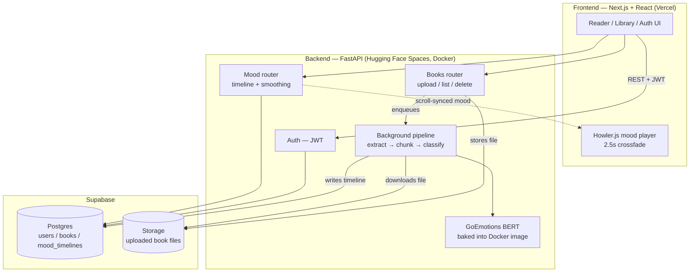

# betterReading 📚

An e-reader that reads the *emotional tone* of your book as you scroll, and plays
ambient music that matches the mood — built end-to-end with a Next.js frontend,
a FastAPI backend, a fine-tuned BERT emotion classifier, and Supabase.

**Live demo:** [better-reading.vercel.app](https://better-reading.vercel.app)
*(backend runs on a free Hugging Face Space — first request after idle may take ~15-20s to wake up)*

---

## How it works

1. **Upload** a PDF or EPUB
2. The backend **extracts and chunks** the text into readable paragraphs
3. Each chunk is run through a **GoEmotions BERT model** (28 emotions → mapped down
   to 13 reading-friendly moods: Joy, Tension/Suspense, Romance, Grief/Despair, etc.)
4. A **smoothing pass** removes single-chunk noise so the mood track doesn't flicker
   between unrelated emotions every paragraph
5. While reading, the frontend tracks scroll position → current chunk → current mood,
   and **crossfades ambient music** to match

---

## Architecture

---

## The emotion pipeline

| Stage | Detail |
|---|---|
| **Extraction** | `pdfplumber` (PDF) / `ebooklib` + BeautifulSoup (EPUB) → clean paragraphs |
| **Chunking** | Paragraphs grouped into model-sized chunks for classification |
| **Classification** | [`monologg/bert-base-cased-goemotions-original`](https://huggingface.co/monologg/bert-base-cased-goemotions-original) — 28-label GoEmotions model, run via 🤗 `transformers` |
| **Mood mapping** | 28 raw emotions collapsed into 13 narrative moods (Joy, Excitement, Anticipation, Wonder/Awe, Mystery, Romance, Tenderness, Peace/Calm, Neutral, Sadness, Grief/Despair, Fear, Tension/Suspense, Anger, Disgust) |
| **Confidence gate** | Low-confidence "Neutral" predictions fall back to the next-best non-neutral label |
| **Smoothing** | Centered mode filter over a sliding window — kills one-off outlier chunks while still reacting to real mood shifts |
| **Playback** | Mood → ambient track lookup, dual-instance Howler.js crossfade as the reader scrolls between moods |

Background processing runs as in-process FastAPI tasks — no queue/worker infra needed.

---

## Tech stack

- **Frontend**: Next.js 16 (App Router), React 19, Motion, Howler.js, Vitest + React Testing Library
- **Backend**: FastAPI, JWT auth, `transformers` + CPU PyTorch
- **Database / Storage / Auth**: Supabase (Postgres + Storage)
- **Deployment**: Vercel (frontend) + Hugging Face Spaces, Docker (backend — model baked into the image for fast cold starts)
